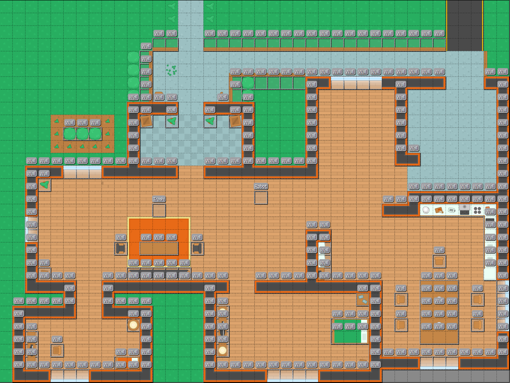
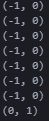

# CS5130 - Project : Robot Cleaner Guide Planner 

## This is robotics problem, where the robot has to do certain task as following :
1. The robot has to find the shortest path to get rid of the dust and dirt
2. The robot should localize itself
3. The robot has to have some sort of planning after each iteration.

### Few Requirement : 
1. Tile map editor : [Tile Map Editor](https://www.mapeditor.org/)
2. Loading the map file ``tmx`` file, use this command ``pip install pytmx``

### Basic Map Environment: (40 tiles * 64, 30 tiles * 64 = 2560 Width, 1200 Height)

  
  

### Robot & Trash Image :

  
  

### Used Breathfirst Search Algorithm as Pathfinding 

## Goal : 
Goal is to have seperate module
1. Maps are already given in the environment 
2. Robot will be able to contol by human - Controllable Action
3. Path Planning Module - Give a path to get to pick up trash

## Process : 
1. Draw the map by tile map editor [o]
2. Creat object layer on the wall and obstacles [o]
3. Make a boundary on the map.[o]
4. Collision Testing with Robot and Trash [o]
5. If there were mutliple trashes, then you have to update the list of trash(pop that element), sort the trash_list by robot's position, then update the start, goal location. [o]
6. Implement Breathfirst search algorithm for shortest path.
   - Filter out the neighbors that colliding with wall and boundary of the map. [o]
   - Keep track the while by checking the neighbors. [o]
   - Blit on the top of the map image.[x]

## Testing and the Result on Terminal:
Robot Pos = [20, 15], Trash Pos = [12,16]

  

## Limitation:
1. Since the ``Tiled`` application outputs the the location of wall start, I have to create single wall as shown in the image above [o]
2. Since the screen.blit(map) were set up as background, the arrow were drawn in the back of the map image.[progress...]

## Comments 
1. The tile map was created and designed by Kenny, which is free-license [Kenny](https://kenney.nl/assets/topdown-shooter)
2. You can find the open source & free licensed game art [Open Game Art](https://opengameart.org/)

## What you can do
1. You can put multiple trashes using ``Tiled`` and put trash object layers.
