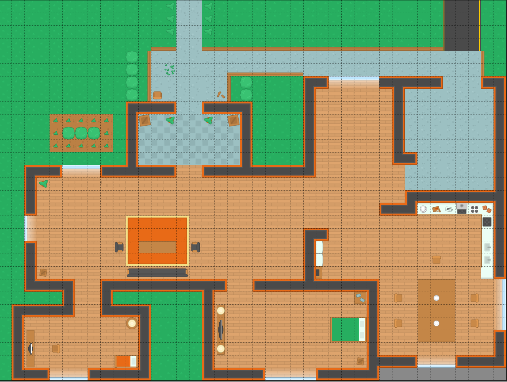

# CS5130 - Project : Robot Cleaner Guide Planner 

This is robotics problem, where the robot has to do certain task as following :
1. The robot has to find the shortest path to get rid of the dust and dirt
2. The robot should localize itself
3. The robot has to have some sort of planning after each iteration.

Few Requirement : 
1. Tile map editor : [Tile Map Editor](https://www.mapeditor.org/)
2. Loading the map file ``tmx`` file, use this command ``pip install pytmx``

Basic Map Environment :

  

Goal : 
Goal is to have seperate module
1. Maps are already given in the environment 
2. Robot will be able to contol by human - Controllable Action
3. Path Planning Module - Give a path to get to pick up trash

Process : 
1. Draw the map by tile map editor
2. Creat object layer on the wall and obstacles
3. Make a boundary on the map.
4. Collision Testing with Robot and Trash

To Do:
1. Collision around the map(world).
2. Do automatic move by path finding algorithm

Comments 
1. The tile map was created and designed by Kenny, which is free-license [Kenny](https://kenney.nl/assets/topdown-shooter)
2. You can find the open source & free licensed game art [Open Game Art](https://opengameart.org/)
