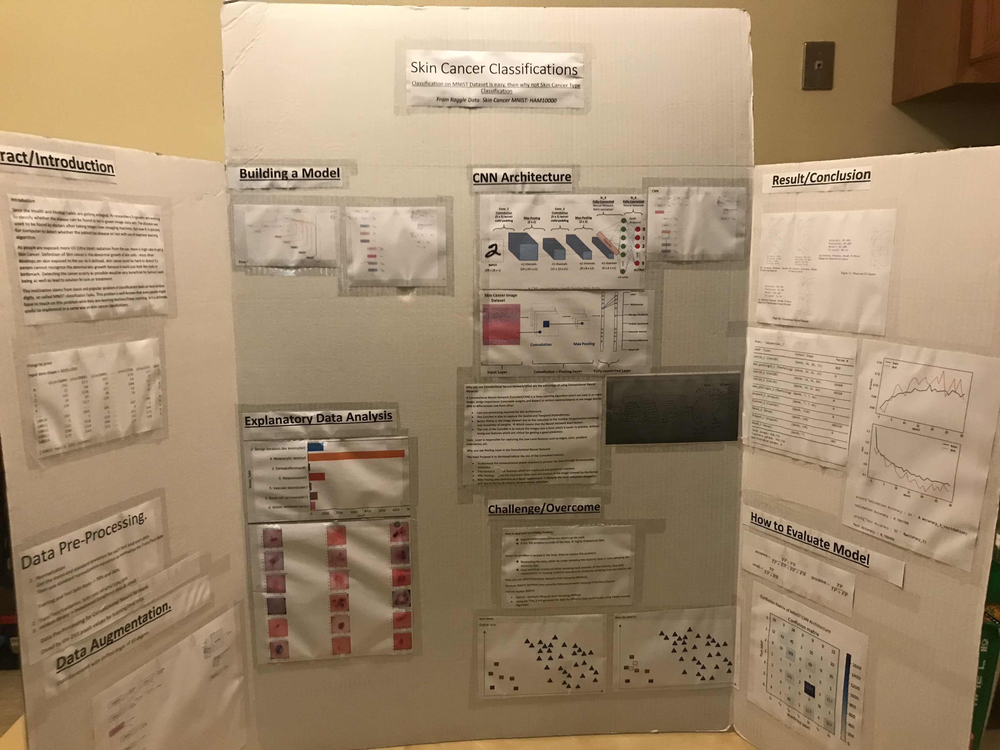

# This is for UMSL CS5300

The data can be found in this link : [https://www.kaggle.com/kmader/skin-cancer-mnist-ham10000]

About this project : This project is to detect which types of the cancer cell is given input image pixels.

## There Are Two Distinct Arcitectures.
1. Feed Foward Neural Network
   - The input pixels are flatten.
   - Comparison between Sigmoid/ReLU
   - After realizing it is overfitting using test dataset, two different methods are used.
     - Drop-out(L2) was used.
   - The data itself is imbalanced, SMOTE(Synthetic Minority Over-Sampling Technique) was used.

2. Convolutional Neural Network(CNN)
   - The input pixels were normalized with standard normalization method.
   - input pixels were transformed with 28x28x3 images, and feed that into architecture itself.
   - Drop-out/Convolutional/Max Pooling Layers were used.
   - One of the Last attempt is to data augmentation, which is tilting the images.. and more images.. 

## Result
Accuracy: 71.08%  
Precision: 76.18%  
Recall: 71.08%  
F1-score: 73.54  
  
## Final Presentation.

