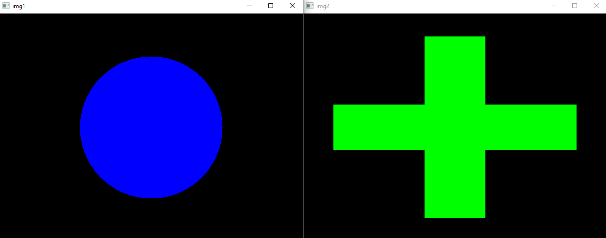
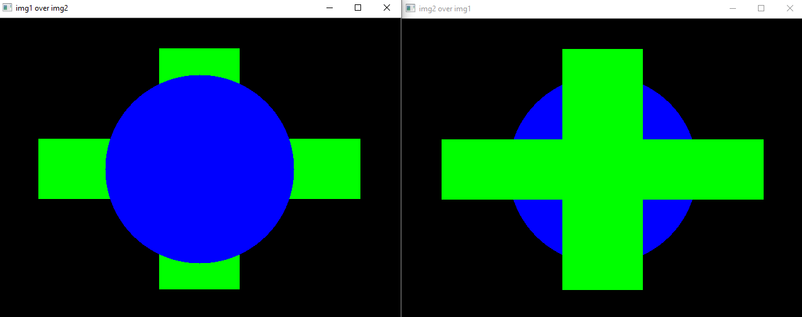
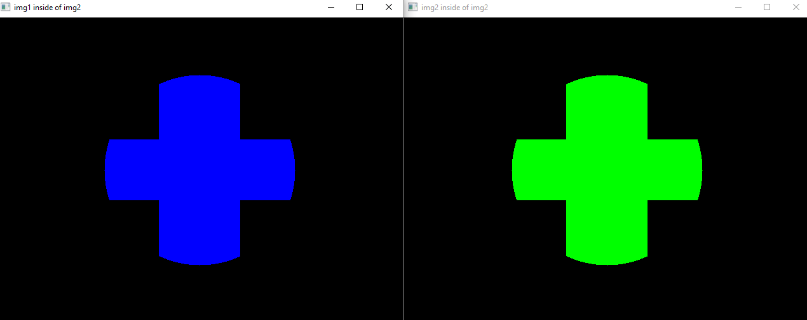
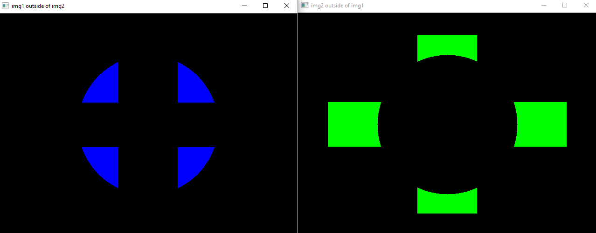
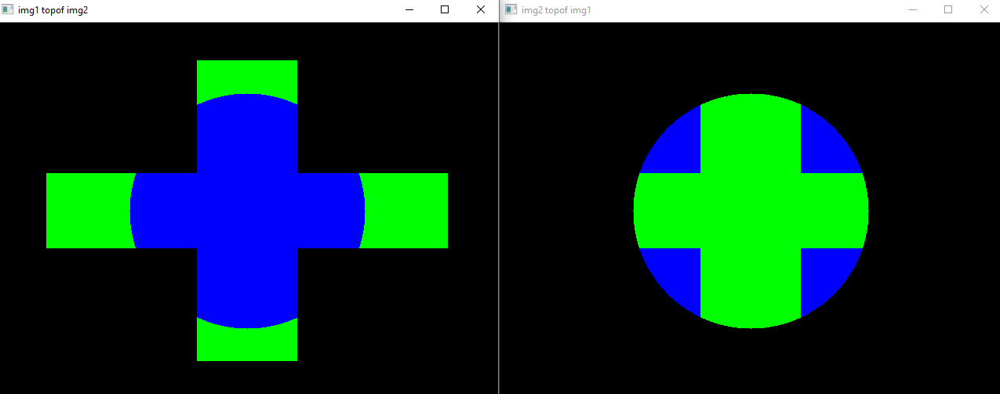
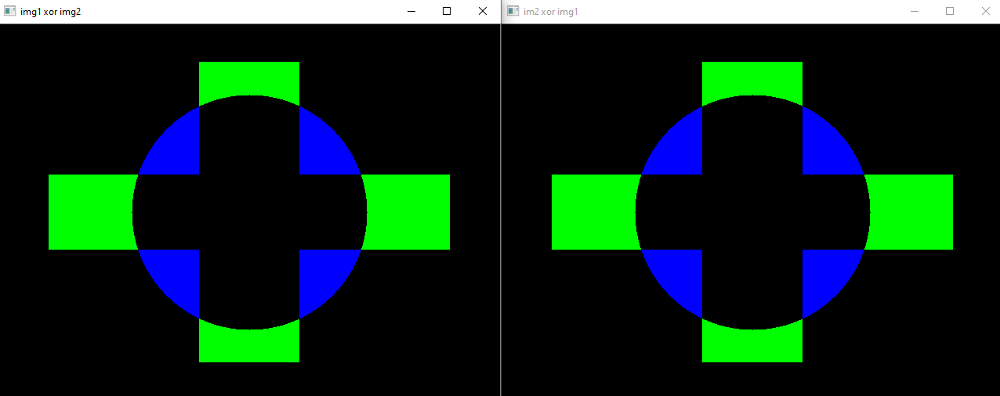

# CS6420 Project1 : Porter Duff Operation.
---

The project detail is located in ./doc folder.

# Usage
## To Build & Compile
`cd build` and `cmake .. && make `

`./Porter_Duff_OP [Image1] [Image2] [mask1] [mask2]`
- **Note : [Image1] & [Image2] is positional arguments**.
**if there are no images, then feed any name of image, then it will create default images**
**[mask1] [mask2] are optional arguments**

# Result
Here are the following results of the default shapes and operation result
## Input Images:

  

## over:

  

## inside:

  

## out:

  

## atop:

  

## XOR :

  

