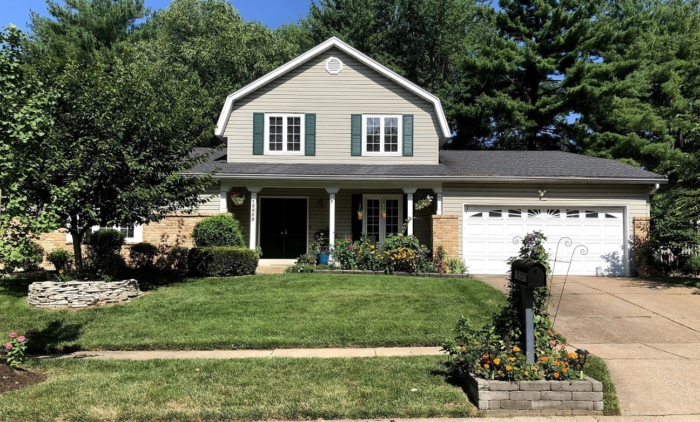
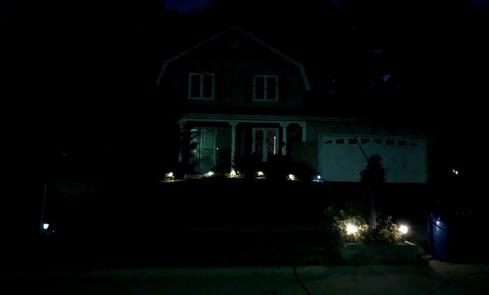
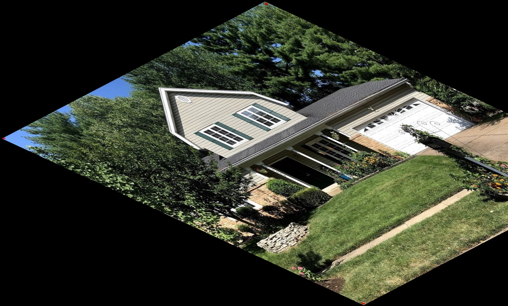
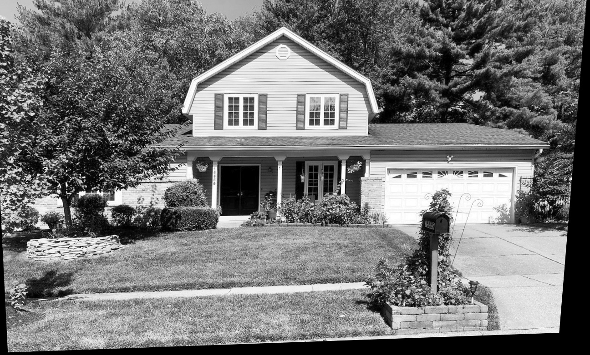
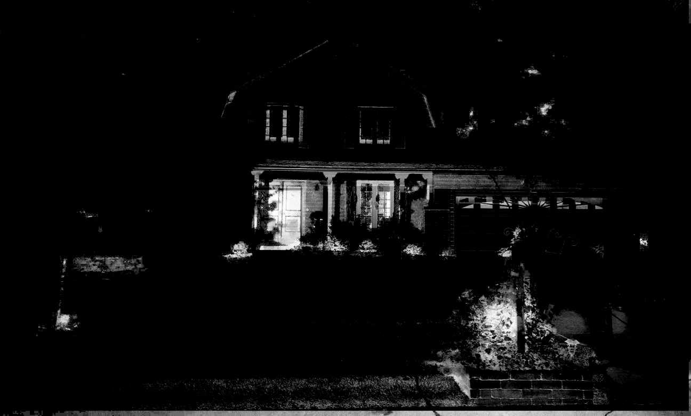

## Image Registration

## Background
What is image registration? - Image registration is the process of `transforming different images of one scene into the same coordinate system`. These images can be taken at different times (multi-temporal registration), by different sensors (multi-modal registration), and/or from different view poitns. 

The spatial relationships between these imags can be rigid (translations and roataions), affine(shears for example), homographies, or complex large deformations models.

<p align="center">
  
</p>

Image registration has a wide variety of applications: it is essential as soon as the task at hand requires comparing multiple images of the same scene. **It is very common in the field of medical imagery, as well as for satelite image analysis and optical flow**


## Project Description

### Usage : 

``cd build && cmake ..``, then `make`

---
**Command Line Argument**
```./project2 [-h] [-M] [-e epsilon] [-m motion_type] [-o output_warp] [-w warp_img] [@image_file] [@template_file] [warp_file]```

**Here is the information for each arguments :**
- ./project2        : Name of executable (register)
- M                 : Perform Manual Registration
- e epsilon         : ECC's convergence epsilon [default: 0.0001]
- m motion_type     : Type of motion (translation/euclidean/affine/homography) [default: affine]
- o output_warp     : Output warp matrix filename [default: out_warp.ecc]
- w warp_img_file   : Warped image [default: warped_ecc.jpg]
- image_file        : Input image (to be warped/aligned)
- template_file     : Template image for alignment
- warped_file       : Input file containing warp matrix

### Results :

**I/O Image**

<p align="center">
  
   
</p>


**Manual Registration [Default : Affine Transformation]**

The manual registration requires a human to identify a set of points(3 pts) in the reference image as well as the corresponding points in the target image.

<p align="center">
  
</p>

**Automatic Warp Registration [Default : Homography]**

<p align="center">
  
</p>

**Error Image**

The amount of translation and scaling in the resulting image compared to the input image

<p align="center">
  
</p>

All the results image & ecc files are stored in `./result` folder 
## Reference :
* [Image Registeration](https://www.sicara.ai/blog/2019-07-16-image-registration-deep-learning)
* [Image_Alignment](https://docs.opencv.org/master/dd/d93/samples_2cpp_2image_alignment_8cpp-example.html#a39)
* [CommandLineParer](https://docs.opencv.org/3.4/d9/d8d/samples_2dnn_2classification_8cpp-example.html#_a0)
