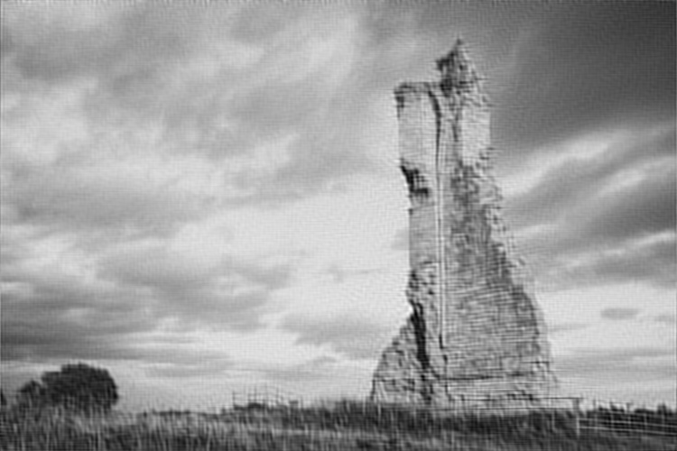

# Project 3 : Denoising the periodic noise in frequency domain. (Automatic Denoising Filter)
---

## Project Description

### Usage : 

``cd build && cmake ..``, then `make`

---
**Command Line Argument**
```./freq_filter [-h] input_image [output_image]```

**Here is the information for each arguments :**
- ./freq_filter     : Name of executable (register)
- input_image       : Perform Manual Registration
- output_image      : ECC's convergence epsilon [default: 0.0001]

### I/O Image
<p align="center">
  
  
</p>

### Contour Process
1. Threshold the magnitude image by looking at the histogram.
2. Find the all contours.
3. Loop through all the contours, find the maximum area.
4. Get rid of rest of the outlines and fill with the outlines using `filled`.

### Merging Process
1. Multiply the result of a contour with complex plane( imaginary & magnitude ).
2. Create the `final plane` to store the product from the step above.
3. Merge two plane into one.
4. Run the `Inverse Descrete Fourier Transform`


## Suggestion
1. It would be good to try to find the contours based on arclength rather than area because it can take more restrictions and more flexible depending on arc length of contours.
2. The result of thresholding is not good in general. It would be better to use Canny or adaptive threshold in advance.

## Reference :
* [Descrete Fourier Transform](https://docs.opencv.org/3.4/de/dbc/tutorial_py_fourier_transform.html)
* [Contours](https://docs.opencv.org/3.4/d4/d73/tutorial_py_contours_begin.html)
* [Contours External](http://hongkwan.blogspot.com/2013/01/opencv-7-4-example.html)
