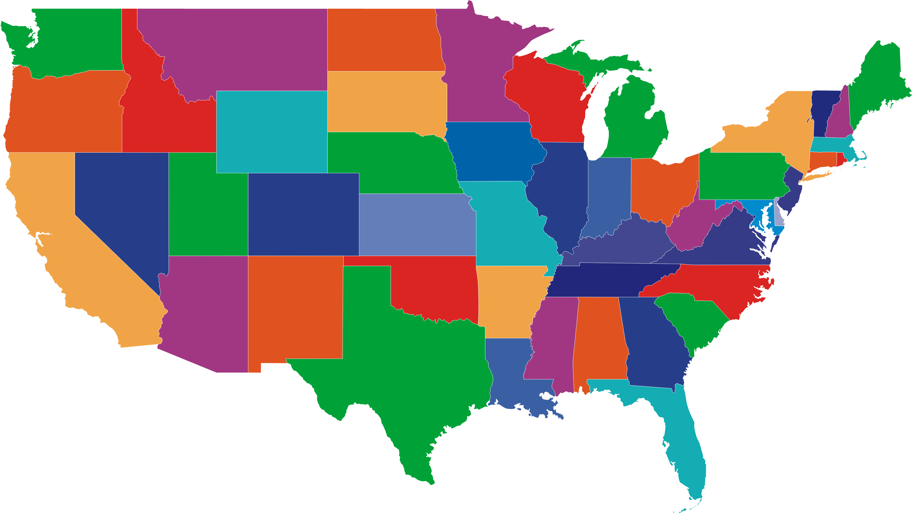

## Project 4 : Image Segmentation using K-mean on the USA map.


## Project Description

### Usage : 

``cd build && cmake ..``, then `make`

---
**Command Line Argument**
```./map_segment [-h] input_image```

**Here is the information for each arguments :**

- ./map_segment : Name of executable (segmentation)
- h                        : help message
- input_image      : Input (All United State Image)

### I/O Image
<p align="center">
  
</p>


### Contour Process & Merging Process
1. Use K - Mean to find all the same color states (Pixel)
2. Filter out small contours (because input image has a anti-aliasing component & existence of alpha channel)
3. Prompt user to select the states (Points) 
4. Find the contours that includes the user-selected points in each clusters
5. Then, manipulate contours
   1. Find the center points using `cv::Moment` 
   2. Subtract the contours point from center points
   3. Multiply the resulting points with the scale
   4. Add the center points back.
6. Draw the contour with `cv::fillpoly`


## Suggestion
1. It would be good to try to get rid of alpha channels before processing it (pre-processing)
2. Sometime it won't detect the Michigan as one state. This might be ways to complete this 
   1.  Use morphology operation (dilate) on contours
   2.  Find all the contours & make boundingRect, then merge if bounding rect if they are close together with "cv::groupRectange"

## Reference :
* [Contours](https://docs.opencv.org/3.4/d4/d73/tutorial_py_contours_begin.html)
* [Merging Bounding Rect](https://stackoverflow.com/questions/29523177/opencv-merging-overlapping-rectangles)
* [K-Mean](https://docs.opencv.org/master/d9/dde/samples_2cpp_2kmeans_8cpp-example.html)
* [How to scale the contours](https://medium.com/analytics-vidhya/tutorial-how-to-scale-and-rotate-contours-in-opencv-using-python-f48be59c35a2)