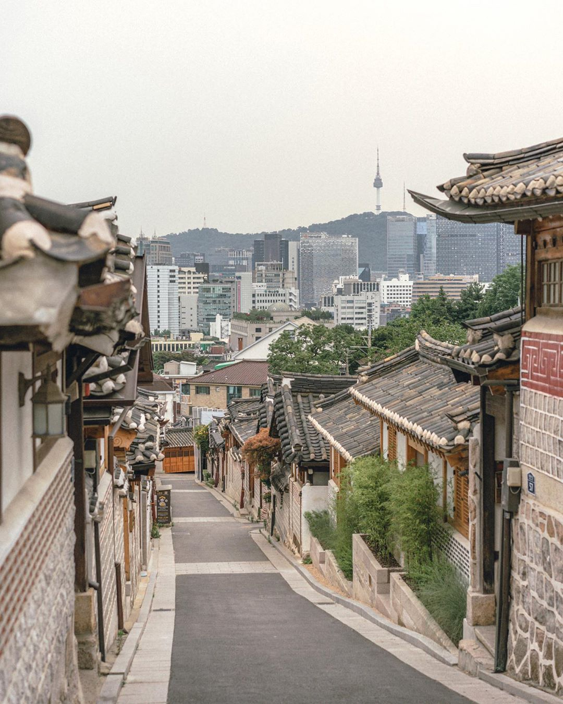

## Project 5 : Image Segmentation with SLIC Pixels.


## Project Description

### Usage : 

``cd build && cmake ..``, then `make`

---
**Command Line Argument**
```./slic [-h] [--algorithm=a] [--ruler=r] input_image```

**Here is the information for each arguments :**

- slic 			 : Name of executable
- algorithm     : Name of `SLIC` algorithm variant
  - `SLIC` segments image using a desired region size
  - `SLICO` optimizes using an adaptive compactness factor
  - `MSLIC` optimizes using manifold methods giving more context-sensitive super-pixels
- size             : Chooses an average super-pixel size measured in pixels [default: 10]
- ruler            : Chooses the enforcement of super-pixel smoothness [default: 10.0]

### Input Image
<p align="center">
<<<<<<< HEAD
  
</p>

### Output Image
